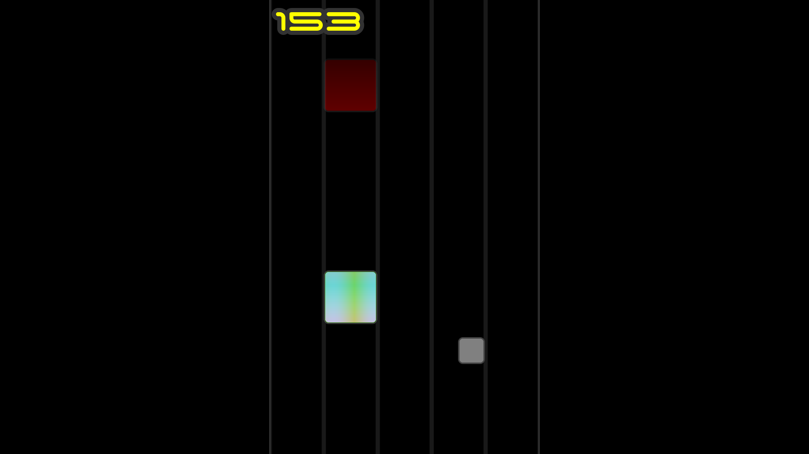

# [C++][SFML] Play-My-Life - 2D Temple-Run like

## Description

Ce projet n'en est pas vraiment un, il s'agit juste d'un entrainement pour une game jam. Le but était de voir ce qui était réalisable, seul, en quatre heures, en partant de zéro.
Cependant pour faire bonne figure, le projet comporte tout de même un petit makefile.

Ce jeu se joue à la manette (si aucune manette n'est branché, l'écran est noir) jusqu'à 3 joueurs.
Le but est simplement d'obtenir le plus haut score possible à l'issue des différentes étapes que l'on fait soit-même défiler en appuyant sur la barre espace.
Ces différentes étapes représentent les étapes du développement d'un jeu.
- L'étape 0 n'en est pas une, c'est juste pour appréhender les contrôles et attendre les connexions des manettes.
- L'étape 1 pareil, c'est juste pour appréhender les mécaniques avant de commencer l'explication.
- L'étape 2 est le début: c'est moche, ça ram, c'est injouable mais l'idée est là.
- L'étape 3 est l'optimisation: c'est toujours moche, mais c'est jouable.
- L'étape 4 est le début du design: c'est toujours un peu moche mais un effort a été fait, on a des sprites (même si je suis pas un designer professionel), et une font, un style graphique
- L'étape 5 est la sortie: c'est censé ne pu être moche, on a nos sprites, des effets de shaders, tout ce qu'il faut pour avoir un jeu lisible et agréable... en théorie.

Voici une image du jeu:

